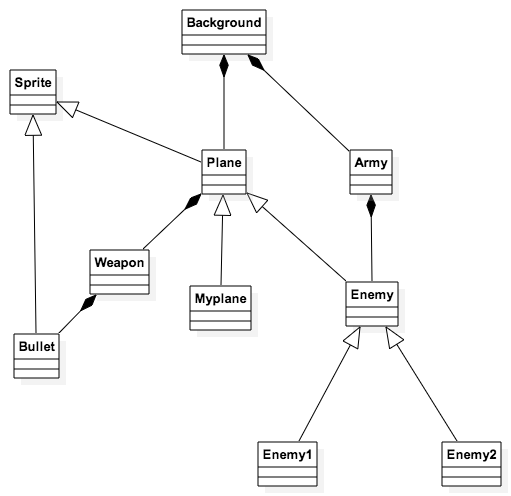
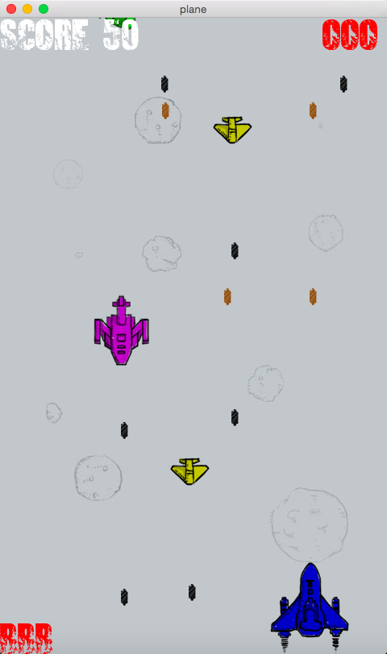
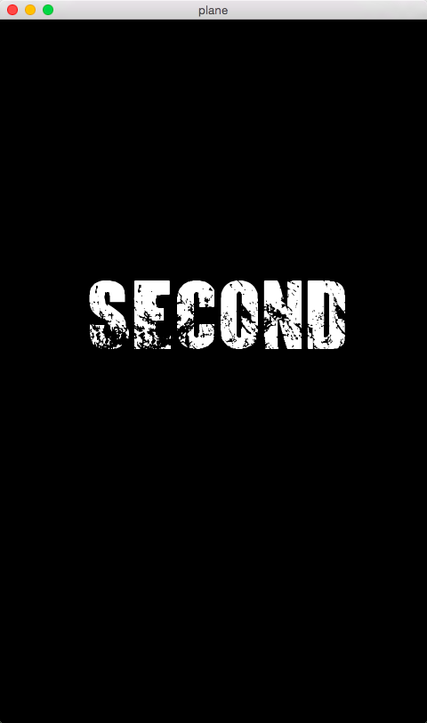

#“打飞机”游戏项目实验报告
---
##1.What to do?
###***要实现哪些功能***
* 玩家可以控制一架自己的的飞机。
* 玩家的飞机可以发射子弹。
* 玩家的飞机可以使用数量有限的大威力炸弹。
* 可以出现多种种敌机。
* 玩家和敌机的子弹的超出边界处理。
* 敌机的超出边界处理。
* 玩家可以控制自己的飞机攻击敌机。
* 敌机和自己的飞机被击毁后均有爆炸效果。
* 敌机被击毁后会随机掉落补给品。
* 补给品有两种，一种可以增加炸弹数量，一种可以升级武器。
* 击毁敌机后可以记分。
* 一局游戏结束后显示最终分数，然后可以选择重新开始或关闭程序。

###***有哪些规则***
* 每次游戏有三条命，每被敌机子弹攻击一次，生命值减少一格。
* 被敌机碰撞，游戏直接结束。
* 每击毁一架敌机，分数加10。
* 通过碰撞补给品，可以获得补给品。
* 武器可以升级3次，每升级一次武器攻击范围扩大一点。
* 炸弹最大拥有量为5，每获得一次炸弹补给数量加一。
* 敌机出现位置随机，敌机垂直向下匀速移动。
* 三种敌机出现频率不同。
* 大型敌机武器更强。
* 游戏时间达到一定长度进入第二关，敌机出现频率以及敌机子弹频率增加。

---
##2.How to do it?
* 用到的IDE:xcode;
* 用到的库: SFML; 配置过程: [配置帮助界面](http://www.sfml-dev.org/tutorials/2.3/start-osx.php)

* 关系图 
* 具体实现见代码

---
##3.How about it?
###***运行截图***
* 游戏运行界面
  
* 过关界面
  
 * game over界面
  
###***缺点***
* 敌机发子弹是同步发射
* 没有设置boss
* 等等

###***玩家评价***
someone：The game is so difficult that I can't pass the first map.

